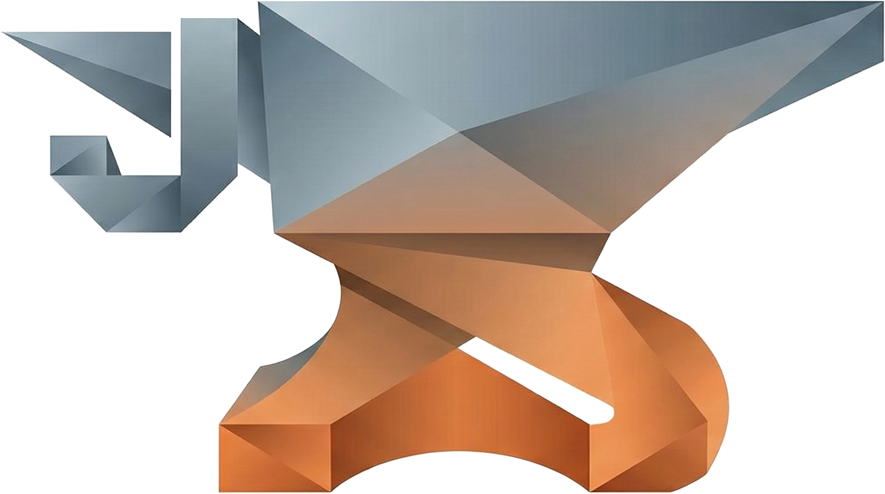

# Jimmy Stridh

### AI Engineer · Full-Stack Developer · Technical Leader
Innovation Engineer at [Spiris](https://spiris.se) | [Visma](https://visma.com) · Gothenburg, Sweden 🇸🇪

Having a lot of fun building with agents. Loves shipping things.

---

## Projects

| Project | Description | |
|---------|-------------|:--:|
| [tenplusone](https://github.com/jimmystridh/tenplusone) | Unofficial Rust CLI for submitting documents to ElevenReader |  |
| [walkingpad-rs](https://github.com/jimmystridh/walkingpad-rs) | Async Rust library and stateless CLI for KingSmith WalkingPad treadmills |  |
| [codex-sdk-swift](https://github.com/jimmystridh/codex-sdk-swift) | Async Swift SDK for the OpenAI Codex app server |   |
| [codex-sdk-rs](https://github.com/jimmystridh/codex-sdk-rs) | Unofficial Rust SDK for the OpenAI Codex app server |   |
| [brownie-bench](https://github.com/jimmystridh/brownie-bench) | Reproducible benchmark for constrained AI brownie formulation |  |
| [streamdeckd](https://github.com/jimmystridh/streamdeckd) | Headless Rust daemon for driving a Stream Deck directly over HID |  |
| [agent-history](https://github.com/jimmystridh/agent-history) | Unified TUI and CLI for browsing local coding-agent session history |  |
| [agent-retrospective](https://github.com/jimmystridh/agent-retrospective) | Turn Claude Code and Codex history into a shareable retrospective |  |
| [pii-masker](https://github.com/jimmystridh/pii-masker) | PII detection and masking library and CLI powered by DeBERTa |   |
| [lab](https://github.com/jimmystridh/lab) | CLI and TUI for managing ephemeral workspaces |  |
| [smartshell](https://github.com/jimmystridh/smartshell) | LLM-powered zsh command generation — Ctrl+G, describe, done |  |
| [slacko](https://github.com/jimmystridh/slacko) | Comprehensive Rust SDK for Slack API with stealth mode |   |
| [datadog-mcp](https://github.com/jimmystridh/datadog-mcp) | MCP server connecting AI assistants to Datadog monitoring |  |
| [datadog-api](https://github.com/jimmystridh/datadog-mcp/tree/main/datadog-api) | Rust client library for Datadog API |   |
| [willys-mcp](https://github.com/jimmystridh/willys-mcp) | MCP server for Willys grocery — cart, orders, AI-powered product matching |  |
| [claude-agents-sdk](https://github.com/jimmystridh/claude-agents-sdk) | Rust SDK for building agents with Claude Code CLI |  |
| [claude-agent-sdk-csharp](https://github.com/jimmystridh/claude-agent-sdk-csharp) | C# SDK for building agents with Claude Code CLI |   |
| [google-docs-skill](https://github.com/jimmystridh/google-docs-skill) | Claude Code skill for Google Docs, Sheets & Drive — native Rust binaries |  |
| [claude-dialog](https://github.com/jimmystridh/claude-dialog) | Native macOS SwiftUI dialog for Claude Code's AskUserQuestion tool |  |
| [gemini-dewatermark](https://github.com/jimmystridh/gemini-dewatermark) | CLI tool to remove watermarks from Gemini-generated images using LaMa inpainting |  |
| [mindscape](https://github.com/jimmystridh/mindscape) | A visual map of what's going on in your head right now |  |
| [geekmagic-stats](https://github.com/jimmystridh/geekmagic-stats) | Push Claude Code usage stats to a GeekMagic SmallTV display |  |
| [cookie-scoop](https://github.com/jimmystridh/cookie-scoop) | Cross-platform browser cookie extraction for Rust |  |
| [toon-rs](https://github.com/jimmystridh/toon-rs) | Token-efficient serialization format for LLMs |   |
| [cc-history-rs](https://github.com/jimmystridh/cc-history-rs) | Terminal UI for exploring Claude Code session history |  |
| [prowl](https://github.com/jimmystridh/prowl) | Fast CLI for Prowl push notifications |  |
| [treenav](https://github.com/jimmystridh/treenav) | Terminal directory navigator with fuzzy search, bookmarks, vim-style keybindings |  |
| [rloc](https://github.com/jimmystridh/rloc) | Blazingly fast line-of-code counter, cloc replacement |  |
| [gorilla.rs](https://github.com/jimmystridh/gorilla.rs) | Rust port of the classic QBasic Gorillas game from 1991 |  |
| [spawngate](https://github.com/jimmystridh/spawngate) | Serverless-style reverse proxy that spawns backends on demand |  |
| [whisperx-transcription](https://github.com/jimmystridh/whisperx-transcription) | Automated audio transcription with WhisperX, speaker diarization |  |
| [node-smtp-sink](https://github.com/jimmystridh/node-smtp-sink) | SMTP testing server with HTTP interface |  |
| [smtp-sink](https://github.com/jimmystridh/smtp-sink) | Minimal SMTP sink for local development and testing |  |
| [spiris-rust](https://github.com/jimmystridh/spiris-rust) | Rust client for Visma eAccounting API |  |
| [spiris-client](https://github.com/jimmystridh/spiris-client) | TypeScript client for Visma eAccounting API |  |
| [vscode-close-all-non-terminal-tabs](https://github.com/jimmystridh/vscode-close-all-non-terminal-tabs) | VS Code extension to close all tabs except terminal editors |  |
| [httpbloke](https://github.com/jimmystridh/httpbloke) | No-nonsense HTTP client for VS Code |  |
| [sidebar-project-md-notes](https://github.com/jimmystridh/sidebar-project-md-notes) | VS Code extension for project-synced markdown notes |  |
| [claude-code-vscode-patcher](https://github.com/jimmystridh/claude-code-vscode-patcher) | Patch Claude Code VS Code extension to inject CLI args |  |
| [alfred-loopback-control](https://github.com/jimmystridh/alfred-loopback-control) | Alfred workflow + CLI for Rogue Amoeba's Loopback |  |
| [claude-code-stats-ubersicht](https://github.com/jimmystridh/claude-code-stats-ubersicht) | Übersicht widget for Claude Code usage stats |  |
| [alfred-trimmy](https://github.com/jimmystridh/alfred-trimmy) | Alfred workflow for trimming multi-line shell commands |  |
| [frasch](https://github.com/jimmystridh/frasch) | Mac OS configuration scripts |  |

---

## Recently Contributed To

| Project | |
|---------|--:|
| [Mole](https://github.com/tw93/Mole) |  |
| [beads](https://github.com/gastownhall/beads) |  |
| [wifitui](https://github.com/shazow/wifitui) |  |
| [go-sqlcmd](https://github.com/microsoft/go-sqlcmd) |  |
| [firecrawl/cli](https://github.com/firecrawl/cli) |  |
| [slayzone](https://github.com/debuglebowski/slayzone) |  |
| [datadog-mcp](https://github.com/ppandrangi/datadog-mcp) |  |

## Tech

